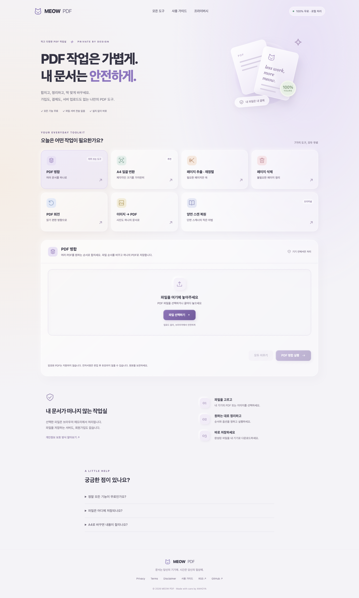

# MEOW PDF

글래스 뉴모피즘 디자인의 무료 로컬 PDF 작업실. 문서 내용과 파일명을 서버로 전송하지 않고 브라우저에서 처리합니다.

[웹사이트](https://meow-pdf-merger-web.vercel.app/) · [제품 기획](docs/PRODUCT-PLAN.md) · [검색엔진 등록](docs/SEARCH-LAUNCH.md)

## 도구

PDF 병합 / A4 일괄 변환(PDF·ZIP) / 페이지 추출·재정렬 / 페이지 삭제 / 회전 / JPG·PNG → PDF / 기존 양면 스캔 복원.

양면 스캔 복원은 앞면과 뒷면을 교차 병합하며, 뒷면 역순·정순 선택, 180도 회전, 마지막 홀수 페이지를 지원합니다.

## 개발

Node.js 22.17 이상 권장.

```sh
npm ci
npm run dev
npm test
npm run build
npx playwright install chromium
npm run test:e2e
```

`dist/`를 정적 호스팅합니다. Vercel 설정은 `vercel.json`에 포함되어 있습니다. `scripts/generate.mjs`가 페이지와 SEO 파일을 생성하므로 생성된 HTML을 직접 수정하지 말고 생성기와 `src/tools.js`를 수정하세요.

환경변수: `SITE_URL`, `GOOGLE_SITE_VERIFICATION`, `NAVER_SITE_VERIFICATION`, `BING_SITE_VERIFICATION`. 검색 등록용 토큰은 각 검색엔진 계정에서 발급해야 합니다.

## 개인정보와 제한

서버 업로드 API, 로그인, 분석·광고·추적 쿠키가 없습니다. 페이지 접속 자체에는 호스팅 요청과 로그가 발생할 수 있습니다. 파일은 메모리에서 처리하고 결과 다운로드만 기기에 저장합니다.

메모리 보호를 위해 한 작업당 총 200 MB까지 선택할 수 있습니다. 기기에 따라 작은 파일도 처리되지 않을 수 있습니다. 암호화 PDF는 지원하지 않습니다. 편집 후 전자서명이 유효하지 않을 수 있고 A4 변환에서 링크·주석·편집 양식은 보존되지 않을 수 있습니다. 원본을 보관하고 결과를 확인하세요.

현재 한국어 UI이며 기존 영어 번역 데이터는 보관됩니다. 가이드 RSS, 정책 독립 페이지, 사이트맵, 정적 메타데이터가 포함되어 있습니다. Google 소유권 인증·사이트맵 제출(15개 페이지 발견)과 네이버 소유확인·사이트맵·RSS 등록을 완료했습니다. Bing은 사이트 추가·인증 태그 배포 후 대시보드가 빈 화면으로 표시되어 최종 인증 확인·사이트맵 제출이 남아 있으며, 상세 상태는 검색엔진 등록 문서에 기록합니다.

## 기술과 검증

Vite, pdf-lib, PDF.js, fflate. 처리 라이브러리는 작업 실행 시 지연 로드하고 PDF.js 워커는 자체 호스팅합니다. Node 테스트와 Playwright 브라우저 테스트를 제공합니다.



MIT License.
